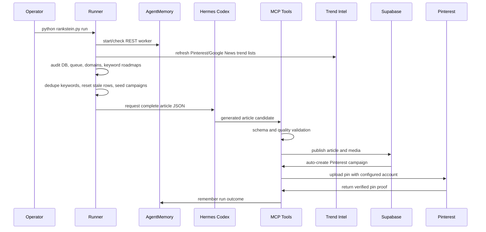

# Autonomous Agentic System

Updated: 2026-07-27

RankStein's autonomous loop is production-oriented but credential-dependent. Hermes Codex is the primary article provider, Python owns orchestration and validation, and MCP servers form the bounded action layer.

## Runtime Sequence

## Agent Rules

- Recall long-term memory before selecting or writing.
- Start through `python rankstein.py run` so DB checks and keyword cleanup happen before new articles are created.
- Refresh daily trend intelligence before campaign seeding unless intentionally running with `--skip-trends`.
- Use real source research before article generation.
- Treat quality validation as a hard gate.
- Use configured Pinterest account handles only.
- Reject queue jobs without configured domain and account handles.
- Use live Pinterest board names in queue payloads. For `r1`, remap content to `Aperitivos`, `Arroces`, `Carnes`, `Chocolate`, `ENSALADES`, `Fresas`, or `Pescados`; `recetas` is not a valid live board.
- Keep a per-account lock around Pinterest create/save flows so multi-worker runs can scale across accounts without colliding inside one account's draft editor.
- Use persistent Chromium profiles for unattended Pinterest automation.
- Keep Pinterest pinning bounded: short publish confirmation, per-job timeout, stale queue lease recovery, and capped retry backoff are required before unattended batches.
- Keep batch worker count aligned with account distribution. Jobs without account handles should run with the stable default of 2 workers; higher concurrency belongs to queues that spread work across configured Pinterest accounts.
- Treat a Pinterest upload as failed unless a real `pin_id` or `pin_url` was captured.
- Mark a keyword `Live` only when the post and Pinterest pin are fully linked.
- Mark article-only or uncertain subprocess success as `Needs Verification`, not `Live`.
- Record failures and wins in AgentMemory with structured context.

## Tool Responsibilities

| Tool Area | Examples |
|---|---|
| Health | `health_check`, runtime validators |
| Memory | `memory_stats`, `search_project_memory`, `memorize_insight`, `remember_pipeline_event` |
| Keywords | `get_pending_keyword`, `mark_keyword_status`, `reset_stuck_keywords` |
| Trends | `refresh_trend_keywords`, `python rankstein.py trends` |
| Research | `scrape_news_sources`, `extract_article_content` |
| Quality | `validate_article_quality` |
| Media | hero generation, image prompt contract, EXIF injection, Supabase upload |
| Pinterest | pin creation, upload, pin-id update, auto-campaign on publish, cross-save, folder batch enqueue |
| Subscribers | root CLI commands only |

## Failure Policy

- Failed research, quality, upload, or pinning must not be hidden.
- A Supabase post without a working Pinterest pin is not a fully live keyword.
- Repeated failures should be written to AgentMemory so future runs adapt.
- Generated artifacts should be cleaned or ignored, not committed.

## Image Prompt Standard

All agents and prompts that create visual assets must follow `docs/templates/IMAGE_GENERATION_CONTRACT.md`.

- Hero and OG prompts describe realistic finished food with no embedded text.
- Pinterest prompts are vertical `2:3`, keep URLs/account handles in metadata, and use short overlay concepts only.
- Every visual brief includes a negative prompt and Spanish alt text.
- Visual lessons may be remembered in AgentMemory as short reusable patterns.

## Autonomous Trend Intelligence

Daily trend intelligence is domain-aware:

1. Build niche seed searches from the domain manifest and category list.
2. Use Playwright browser automation against Pinterest Trends/Search first.
3. Fall back to the public Pinterest page/API path only if Playwright collection fails.
4. Validate candidate keywords with Google News RSS.
5. Write `data/domains/<handle>/daily_best_keywords.json` and `.md`.
6. Append only new keywords to `data/domains/<handle>/keywords.md`.

Connected agents can call the same logic through the RankStein MCP tool `refresh_trend_keywords`.
