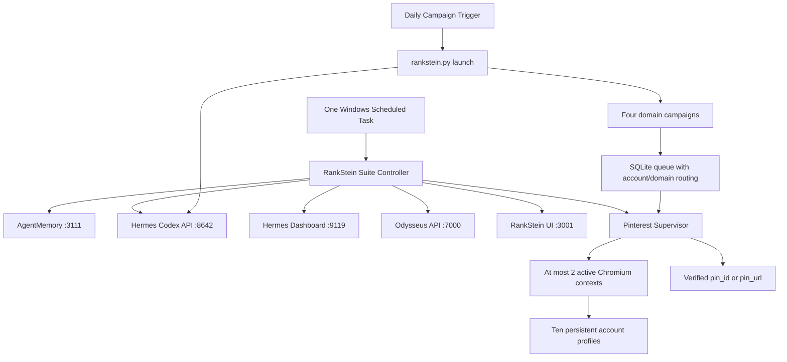

# Production Runtime Plan

Updated: 2026-07-27
Status: Phase 1-3 foundation implemented; expansion gates remain

## Objective

Run RankStein every day on this Windows workstation for four recipe blogs and
ten Pinterest accounts while keeping content, browser identity, rate limits,
queues, and failures isolated by domain and account.

The production target is reliable recovery and provable publishing, not
unbounded concurrency. The host has enough memory for the workload when browser
concurrency is kept at two initially and raised only after measured canaries.

## Current Readiness

| Area | Current state | Production gate |
|---|---|---|
| Blogs | 2 configured | Add and validate 2 domain manifests |
| Pinterest | 2 authenticated Chromium accounts; headless login verified | Provision 8 profiles through interactive login |
| Publishing | Verified pin proof remains mandatory | Run a controlled 24-hour canary before expansion |
| Hermes Codex | Required and healthy on port 8642 | Monitor provider latency and fallback use |
| Odysseus | API healthy on port 7000; optional proxy disabled | Keep proxy off unless a consumer requires it |
| Frontend | Healthy on port 3001; Hermes WhatsApp owns 3000 | Preserve explicit ownership checks |
| Supervisor | Singleton lease, heartbeat, process-aware status, graceful stop | Complete 24-hour canary |
| Browser health | Every configured profile checked; recovery uses supervisor loop | Monitor cooldown and login expiry |
| Sessions | Two primary profiles retained; stale pool directories removed | Keep two-session cap |
| Queue | Clean and identity-required | Monitor queue age and DLQ |
| Fanout | Deterministic one-uploader routing; cross-save defaults to zero | Tune only from measured results |
| Rate limits | Domain/account operation keys with conservative limits | Tune only after canaries |
| Startup | Unified controller and two scheduled tasks verified with result 0 | Disable legacy tasks from an elevated shell |
| Docker | Client installed; engine offline | Use a hybrid topology after host runtime is stable |
| Validation | Unit and isolated automation checks pass | Repeat after every deployment |

## Target Topology

Hermes, Playwright, and authenticated browser profiles remain on the Windows
host. Containers are introduced only for stateless HTTP services after the host
controller is proven. A container must reach Hermes through
`host.docker.internal:8642`, never container-local `127.0.0.1`.

## Account And Domain Model

Each Pinterest account record must define:

- stable account handle and persistent session name;
- enabled/disabled state and cooldown state;
- allowed domain handles and board allowlist;
- daily, hourly, and burst budgets;
- one active create/save flow at a time;
- last successful proof, last login check, and health state.

Each domain must define its own Supabase destination, public URL, niche, voice,
board mapping, account cohort, and daily article/pin budget. Jobs missing either
`domain_handle` or `account_handle` fail closed after the legacy migration.

## Routing Policy

Do not combine upload-to-every-account with save-to-every-other-account.

The default production policy is:

1. Assign each domain a small account cohort.
2. Choose one primary uploader for each asset using fair rotation.
3. Add zero or a bounded number of saves only inside that domain cohort.
4. Enforce uniqueness on destination URL, image hash, account, and operation.
5. Pause campaign enqueueing when queue age or projected drain time exceeds the
   configured service objective.

This changes an article from quadratic fanout to a predictable bounded workload.

## Delivery Phases

### Phase 0 - Maintenance Safety

- Pause new campaign enqueueing without discarding the live queue.
- Snapshot the queue database and account registry.
- Record active browser profile ownership and preserve primary profiles.
- Establish rollback commands and a maintenance log.

Gate: queue backup restores successfully in an isolated validation directory.

### Phase 1 - Runtime Correctness

- Dispatch health recovery onto the main asyncio loop and suppress duplicate
  stale-session recovery events.
- Check health for every configured account.
- Change Pinterest mutual exclusion from account-plus-board to account only.
- Add a supervisor singleton lock, heartbeat file, graceful shutdown, and
  external process-aware status.
- Replace ever-increasing pool names with bounded per-account slots.
- Add a dry-run session cleanup tool, then quarantine stale pool directories.
- Standardize every launcher and task on the repository `.venv`.
- Move the RankStein frontend to port 3001 and validate process ownership, not
  only whether a port is open.

Gate: 24 hours on the two current accounts with no duplicate supervisor, no
orphan profile growth, no event-loop recovery errors, and verified pin proofs.

### Phase 2 - Queue And Scaling Correctness

- Introduce the account registry and domain-to-account cohort configuration.
- Replace quadratic campaign fanout with the routing policy above.
- Persist account-scoped and domain-scoped budgets and cooldowns.
- Add fair dequeueing across healthy accounts and domains.
- Backfill domain identity where it is provable; quarantine ambiguous jobs.
- Deduplicate active jobs and add database uniqueness guards.
- Report queue age, throughput, projected drain time, and oldest job.

Gate: deterministic tests prove bounded job counts for 2, 4, and 10 accounts;
no job can execute without configured domain/account identity.

### Phase 3 - Unified Windows Operations (COMPLETED)

- Add one idempotent suite controller with `status`, `preflight`, `start`,
  `stop`, `restart`, `install`, and `uninstall` commands.
- Start dependencies in order and wait for semantic health checks.
- Add capped exponential restart backoff and a restart budget.
- Replace broken Hermes tasks and overlapping RankStein launchers only after the
  suite controller passes a reboot drill.
- Add separate daily campaign scheduling with a singleton campaign lease.
- Add rotating logs, disk thresholds, retention, and alert-ready status output.
- Deprecate scripts that set 10-20 workers or delete primary browser profiles.

Gate: three cold-start and three forced-recovery drills succeed without port,
PID, task, queue, or browser-profile conflicts.

### Phase 4 - Hybrid Containers

- Pin one dependency source and align it with the tested host environment.
- Harden `.dockerignore` against nested secrets, sessions, generated media, and
  queue databases.
- Build compose profiles for stateless API and frontend services.
- Add health checks, resource limits, read-only mounts where possible, and
  named persistent volumes only where required.
- Keep Hermes and Pinterest browsers on the host for the first production
  release.

Gate: images build reproducibly, contain no secrets, pass health checks, and do
not increase browser/session contention.

### Phase 5 - Controlled Expansion

- Provision the two new domain manifests and validate their Supabase targets.
- Bootstrap eight new Chromium profiles through one-time interactive login.
- Assign accounts to domain cohorts and validate board allowlists.
- Canary at 2, then 4, 6, and 10 configured accounts for at least 24 hours per
  stage.
- Keep two active browser workers initially. Raise to three only if memory,
  CPU, disk, queue latency, and Pinterest cooldown data remain healthy.

Gate: four domains and ten accounts are configured, but only healthy accounts
receive work; daily reports prove publication, storage, and Pinterest linkage.

## Production Service Objectives

- No duplicate supervisor or campaign worker processes.
- No more than one active Pinterest create/save flow per account.
- No keyword marked `Live` without Supabase, storage, and verified Pinterest
  proof.
- No deterministic or template fallback article is published.
- No unbounded browser-profile or log growth.
- No queue job executes with unknown account or domain identity.
- Restart recovery completes without human intervention for transient failures.
- Authentication expiry fails closed and requests interactive reauthentication.

## Required Operator Inputs

Implementation can fix the two-account runtime before these inputs arrive.
Final expansion requires:

- the two new public blog domains, niches, and intended brand voices;
- the eight additional Pinterest account handles and their domain assignments;
- one-time interactive login availability for each new account;
- the preferred daily campaign time and confirmation that Windows remains
  logged in when browser automation should run.

Secrets must be added locally through environment files or the credential store,
not placed in tickets, logs, documentation, or agent memory.
