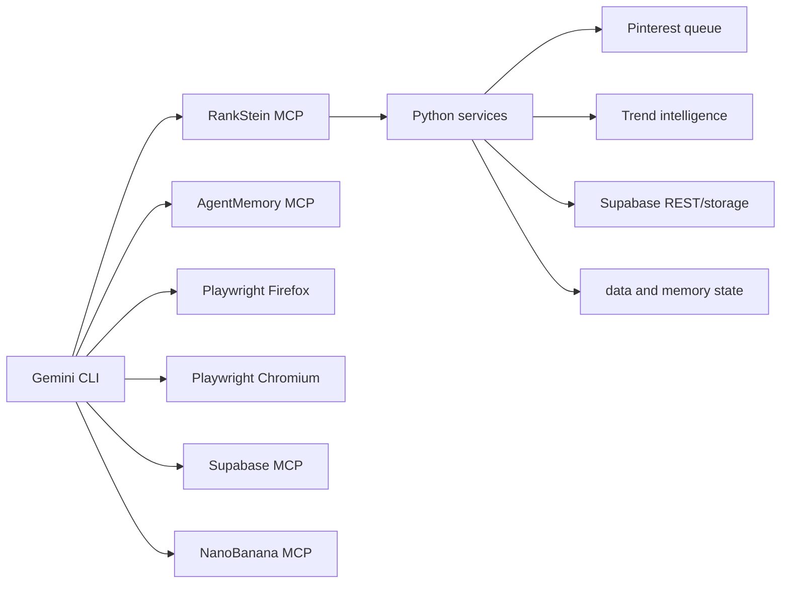

# RankStein Project Map

Updated: 2026-05-14

RankStein turns pending recipe keywords into researched Spanish content, generated images, Pinterest distribution, Supabase publication, and remembered operational lessons.

## Directory Map

| Path | Role |
|---|---|
| `rankstein/` | Core CLI, domain registry, shared config, subscriber commands. |
| `rankstein/trend_intelligence.py` | Playwright-first Pinterest trend collection and Google News ranking. |
| `rankstein/site_factory.py` | Clones and rebrands the RecetaDolce template for new domain projects. |
| `rankstein/autonomous.py` | Repeatable autonomous startup loop with AgentMemory logging. |
| `rankstein_mcp_server.py` | Main project MCP server used by Gemini CLI. |
| `backend/` | FastAPI app, agent classes, services, memory client, AI engine adapter. |
| `pinterest_automation/` | Queue, session pool, browser automation, health monitoring, campaign engine, MCP bridge. |
| `pinterest_automation/campaign.py` | Auto-campaign on publish: enqueues pin_upload jobs for all accounts; folder batch enqueue. |
| `frontend/` | Next.js operator UI. |
| `scripts/dev/` | Validators, AgentMemory starter, self-cleaner. |
| `tests/` | Unit and integration coverage. |
| `memory/` | Keyword/backlog state still consumed by tools. |
| `data/` | Local runtime state; ignored except intentional placeholders/config. |
| `docs/system/` | Canonical documentation. |
| `.gemini/settings.json` | MCP server registration for Gemini CLI. |

## Runtime Map

## Main Workflows

| Workflow | Entry |
|---|---|
| Autonomous content run | `python rankstein.py run` |
| Audit/seed without workers | `python rankstein.py run --no-launch --json` |
| Daily trend refresh | `python rankstein.py trends --limit 10` |
| Continuous local loop | `python rankstein.py autonomous --interval-hours 24` |
| Domain management | `python rankstein.py list-domains`, `show-domain`, `run` |
| New blog factory | `python rankstein.py add-domain <domain> --clone-site` |
| Subscriber management | `python rankstein.py subscribers ...` |
| AgentMemory startup | `scripts/dev/start_agentmemory.ps1` |
| Runtime validation | `scripts/dev/validate_gemini_runtime.py` |
| Pinterest validation | `scripts/dev/validate_automation.py` |
| Pinterest folder enqueue | `python run_autonomous.py enqueue-folder` |
| Project cleanup | `scripts/dev/self_clean.py` |
| File-by-file audit | `scripts/dev/project_audit.py` |

## Documentation Ownership

This project intentionally has fewer Markdown files now. Old duplicated context docs were removed. New operational changes should update the canonical docs listed in `docs/system/PROJECT_HYGIENE.md`.
