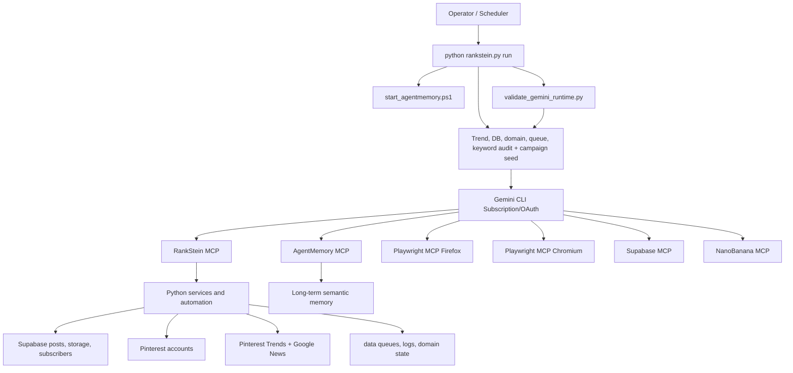

# System Architecture

Updated: 2026-05-14

RankStein is a tool-using autonomous content system. Gemini CLI is the reasoning engine, MCP servers expose capabilities, and Python services execute the project-specific work.

## Architecture

## Layers

| Layer | Responsibility |
|---|---|
| Gemini CLI | Plans the autonomous run and chooses tools. |
| MCP servers | Provide bounded capabilities: RankStein, browsers, Supabase, images, memory. |
| RankStein Python | Owns domain logic, validation, publishing payloads, queues, subscribers, and config. |
| Playwright | Controls Pinterest browsers through Firefox and Chromium, including Pinterest trend discovery. |
| Supabase | Stores published posts, media references, and subscriber records. |
| AgentMemory | Stores reusable lessons and recurring operational facts. |
| Frontend | Operator UI for monitoring; not the secret-bearing admin plane. |

## Content Flow

```mermaid
flowchart LR
    Trend["Pinterest niche trends"] --> News["Google News validation"]
    News --> Keyword["Domain keyword roadmap"]
    Keyword --> Startup["Clean roadmap + ensure DB campaign"]
    Startup --> Memory["Recall AgentMemory lessons"]
    Memory --> Research["Research and extract sources"]
    Research --> Draft["Generate Spanish article JSON"]
    Draft --> Quality["Quality gate"]
    Quality --> Hero["Hero image"]
    Hero --> Pin["Pinterest pin"]
    Pin --> Publish["Supabase publish"]
    Publish --> Campaign["Auto Pinterest campaign"]
    Campaign --> CrossSave["Cross-save to all accounts"]
    CrossSave --> Proof["Completion proof"]
    Proof --> Status["Keyword status"]
    Status --> Remember["Remember outcome"]
```

`Live` is allowed only when publication, Pinterest upload, and pin-id update all succeed. Partial success must be recorded as a failed or incomplete run.

Production status meanings:

- `Pending`: ready to be selected.
- `In Progress`: leased by a worker.
- `Needs Verification`: article/process completed but pin/publish proof is incomplete.
- `Failed`: worker failed and recovery is required.
- `Live`: publish, Pinterest, and linkage proof are complete.

## Data And State

| Path | Meaning |
|---|---|
| `memory/*.md` | Human-readable workflow state still read by tools. |
| `data/domains/*/keywords.md` | Domain-specific keyword roadmaps. |
| `data/domains/*/daily_best_keywords.*` | Daily Pinterest/Google News trend shortlist. |
| `data/queue/` | SQLite job queue (`jobs.db`) for Pinterest automation. |
| `data/sessions/` | Sensitive browser sessions, ignored except placeholders. |
| `pinterest_automation/campaign.py` | Auto-campaign engine: triggers Pinterest jobs on article publish. |
| `docs/system/` | Canonical system documentation. |
| `.gemini/settings.json` | Project MCP registration. |

## Non-Goals

- No API-key-only replacement for Gemini CLI subscription/OAuth.
- No frontend subscriber admin.
- No committed browser profiles, generated article payloads, local debug scripts, or duplicate context docs.
