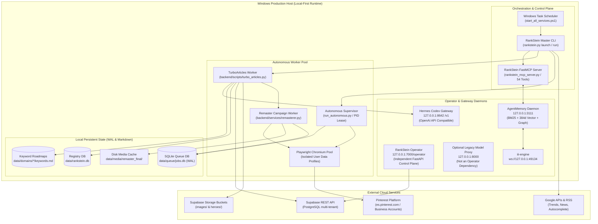
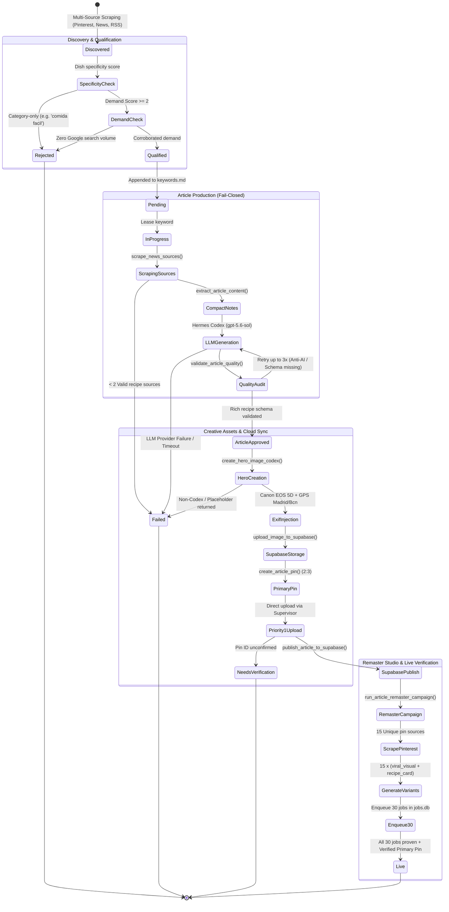
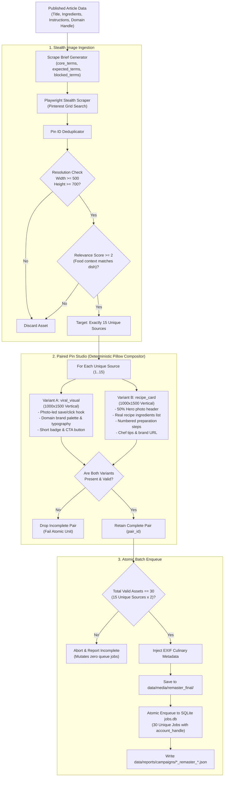
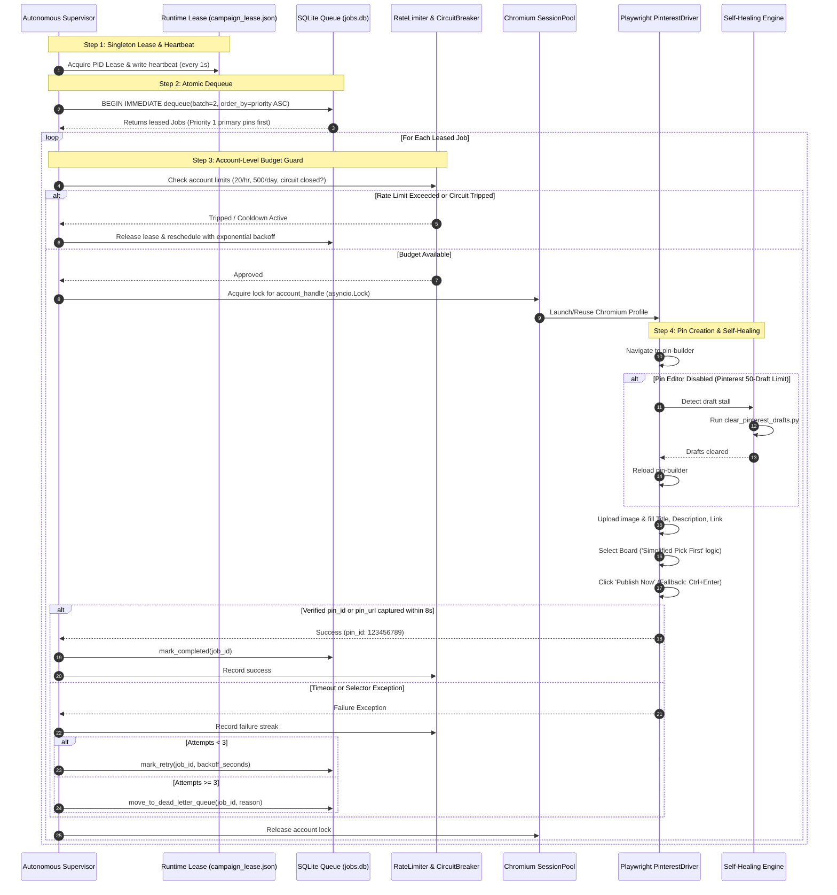
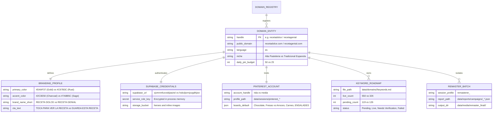

# System Architecture

Updated: 2026-10-06

RankStein is a local-first, multi-tenant autonomous publishing and social syndication ecosystem. Hermes Codex generates researched Spanish culinary content, MCP servers expose tool interfaces, Python services execute domain and campaign logic, Playwright controls unattended Chromium browser sessions, Supabase stores articles and media, and AgentMemory tracks durable operational lessons.

---

## 1. Multi-Tier Process Topology & Port Mapping (C4 Container Model)

This diagram details the actual process boundaries, network protocols, IPC interfaces, and listening ports across the local Windows host and external clouds.

---

## 2. End-to-End Keyword-to-Live Content Lifecycle State Machine

This state machine defines the qualification gates, extraction rules, and fail-closed transitions required before a keyword can enter production or reach `Live` status.

---

## 3. The 30-Pin Remaster Studio Pipeline

This flowchart documents the atomic pair generation and deterministic typography engine that transforms 15 unique scraped Pinterest sources into 30 luxury pins.

---

## 4. Autonomous Pinterest Supervisor & Self-Healing Loop

This sequence diagram details unattended Pinterest automation, singleton leasing, account-level serialization, rate budgeting, and automated draft-clearing.

---

## 5. Multi-Tenant Domain Partitioning & Isolation Matrix

This entity-relationship model defines how the Domain Registry (`rankstein/domain.py`) guarantees multi-tenant isolation across all system resources.

---

## 6. Core Component Reference

| Layer | Primary Source Files | Core Responsibility |
|---|---|---|
| **CLI & Suite Control** | `rankstein.py`, `rankstein/cli.py`, `rankstein/launcher.py` | Full-service preflight, health checks, domain administration, and service bootstrapping. |
| **Domain Registry** | `rankstein/domain.py`, `data/domains/` | Multi-tenant isolation for credentials, palettes, branding tokens, categories, and roadmaps. |
| **Trend Discovery** | `rankstein/trend_intelligence.py` | Gathers candidate recipe trends, enforces dish specificity, and validates search demand depth. |
| **Article Worker** | `backend/scripts/turbo_articles.py` | Scrapes 2+ recipe sources, queries Hermes Codex (`gpt-5.6-sol`), enforces Schema.org recipe JSON, and publishes to Supabase. |
| **Quality Validator** | `backend/services/quality_evaluator.py` | Rejects template text, missing ingredients/instructions, AI boilerplate, and unformatted lists. |
| **Hero Image Engine** | `backend/scripts/hero_image_pipeline.py` | Generates photorealistic 16:9 hero images with Codex `gpt-image-2`, injects EXIF metadata, and uploads to cloud storage. |
| **30-Pin Remasterer** | `backend/services/remasterer.py`, `rankstein/remaster_variants.py` | Scrapes 15 unique dish-relevant Pinterest pins and outputs paired 1000x1500 assets (`viral_visual` and `recipe_card`). |
| **Job Queue** | `pinterest_automation/job_queue.py` | SQLite WAL-backed queue with atomic `BEGIN IMMEDIATE` dequeuing, priority levels, and Dead Letter Queue (DLQ). |
| **Supervisor & Driver** | `pinterest_automation/supervisor.py`, `pinterest_automation/pinterest_driver.py` | Unattended Playwright Chromium automation with profile isolation, account locks, rate limits, and draft auto-clearing. |
| **Memory & Tool API** | `rankstein_mcp_server.py`, `scripts/dev/start_agentmemory.ps1` | 54 FastMCP tools and hybrid triple-stream memory engine storing operational lessons and telemetry. |

---

## 7. Non-Negotiable Operational Invariants

1. **Fail-Closed on Non-LLM Text:** No article may be published from deterministic, mock, or template text. If LLM providers fail, the keyword is marked `Failed` and halts.
2. **Strict Recipe Schema:** `recipeIngredient` and `recipeInstructions` arrays must never be empty.
3. **Atomic 30-Pin Remaster Target:** Remaster campaigns must yield exactly 15 unique sources and 30 paired assets (`viral_visual` + `recipe_card`). If fewer survive, zero jobs are enqueued.
4. **Verified `Live` Criteria:** A keyword is marked `Live` **only** when Supabase publish, hero storage, verified primary `pin_id` / `pin_url`, and the 30-pin remaster enqueue all succeed.
5. **Chromium Exclusivity:** Unattended Pinterest automation runs exclusively on Chromium to avoid Firefox lock stalls.
6. **Account Concurrency Limit:** Exactly one active browser session per Pinterest account handle at any given moment.
